# SQL Developer Data Modeler best practices
{: .no_toc }

# Table of contents
{: .no_toc .text-delta }

1. TOC
{:toc}

# Introduction

A long time ago, when I started to work with Oracle products so some 25 years
ago, Oracle provided Oracle Designer as a CASE tool to generate a relational
model from a logical model and from that the DDL could be generated. Those
days have long been gone. So how do you generate a relation model from a
logical model using SQL Developer Data Modeler? This document describes how to
do it in a trial and error fashion. At the end I will give the full receipt of
best practices. Please note that the version of Data Modeler I used was
18.4. Things may have changed since.

# Conclusion

In my opinion it is really possible	to define a logical model in SQL Developer
Data Modeler and finally generate DDL from it. Compared to Oracle Designer,
the product I grew up with, it seems a bit more work but you have also more
control via the custom transformation scripts. I do think that you need to
define and follow best practices, like I described here. Although the product
is complex and contains some bugs, I would really advise against the DIY (Do
It Yourself) method.

An issue that needs to be solved is how to share information like
transformation scripts within your team/organisation since they are not stored
as part of your model but as part of the SQL Developer Data Modeler
installation/configuration. I have added the scripts as an appendix but
version control is really necessary here.

# Pitfalls

This chapter describes some common problems while designing models.

## Surrogate keys

First of all, when you need to know more about surrogate keys, please have a
look at
[https://www.thatjeffsmith.com/archive/2015/10/designing-surrogate-vs-natural-keys-with-oracle-sql-developer/](https://www.thatjeffsmith.com/archive/2015/10/designing-surrogate-vs-natural-keys-with-oracle-sql-developer/).  

If I remember it well, Oracle Designer had an option to generate surrogate
keys that worked very well. Whatever you think about the pros and cons of
surrogate keys, if you want to use surrogate keys in SQL Developer Data
Modeler, how do you do that? SQL Developer Data Modeler has an option to
generate surrogate keys but of course you can create those IDs yourself. We
will discover what is the best approach during our journey. 

## Super and subtypes

Another hot topic was always the issue of generating tables for super and
subtypes (inner entities). For a discussion see
[https://stackoverflow.com/questions/12032348/how-are-super-and-subtype-relationships-in-er-diagrams-represented-as-tables](https://stackoverflow.com/questions/12032348/how-are-super-and-subtype-relationships-in-er-diagrams-represented-as-tables). The
promoted way on Stack overflow is to create a table for both the parent and
child tables. The parent primary key should be duplicated in the child tables
as both a primary key and foreign key to the parent (without a sequence
generator). In the parent table a discriminator column should be added that
points to the child table (when the subtypes are exclusive as is usually the
case). During an insert into a child, the parent needs to be inserted first,
its primary key used to insert into the child table and the discriminator of
the parent needs to be checked during the child insert. 

If I remember it well, with Oracle Designer I usually created a single table,
an approach that is not advised anymore. Once again, how do we generate tables
for super and subtypes in SQL Developer Data Modeler? We will discover that
during the journey. 

## Many-to-many relations

There are two approaches here:

1. Create a many\-to\-many relation only if there are no extra attributes for the relation and create intersection entities when there are extra attributes;

2. Create a many\-to\-many relation if needed and add attributes.

The first approach is more or less the old Oracle Designer approach and the second approach is made possible by SQL Developer Data Modeler:

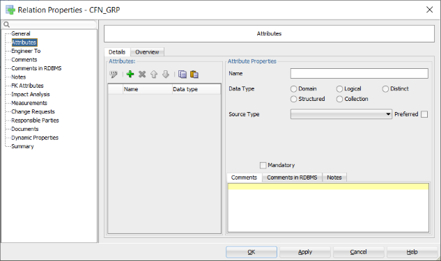

Figure 1 Attributes of a relation

I have used the old approach in my example.

# Engineer to relational model

## The ERD

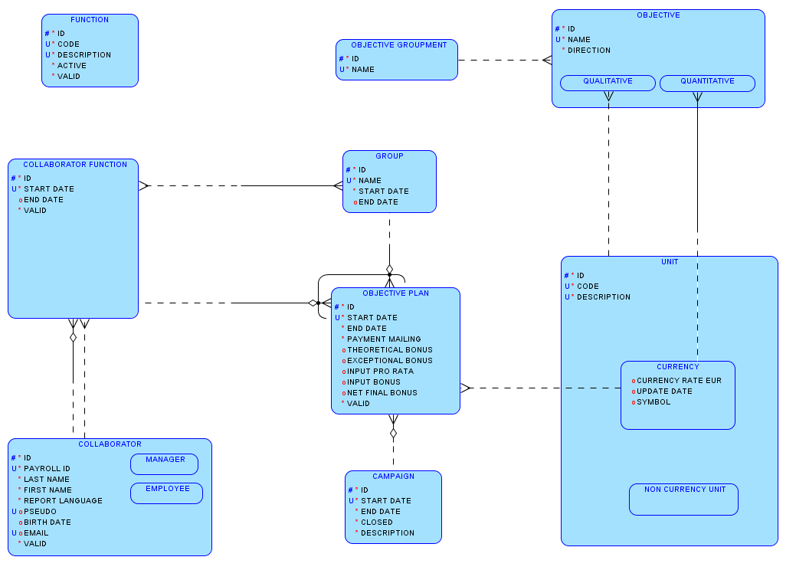

Figure 2 An example entity relationship diagram

## Configuration

### Glossary

If you use a glossary with abbreviations, all names will be abbreviated. I do not like that so I do not specify a glossary as part of the design:

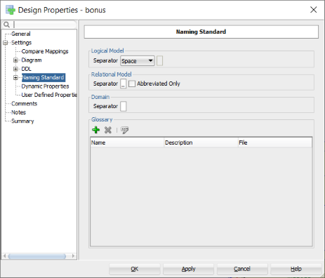

Figure 3 Do not use a glossary if that contains abbreviations

### Naming standards

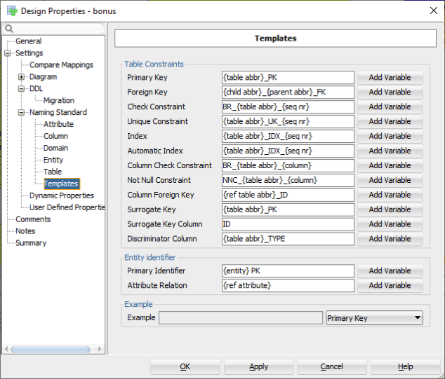

Figure 4 Naming standards

Please note that the Check Constraints start with BR to indicate Business Rules.

### Surrogate keys

For those entities and (many\-to\-many) relationships that need surrogate keys but do not have them yet, the "Create Surrogate Key" or "Use surrogate keys" option is set:

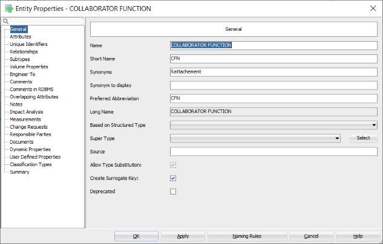

Figure 5 Surrogate keys for an entity

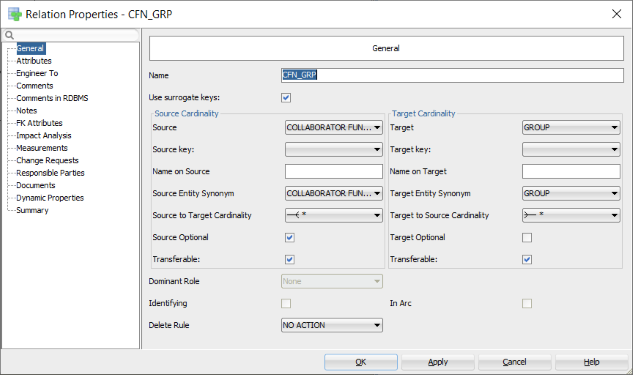

Figure 6 Surrogate keys for a relation

## The first attempt with manually created surrogate keys

I did run the Engineer to relational model for this logical sub view:

Figure 7 Manually created surrogate keys

 Select your logical model, right click and select "Engineer to Relational Model". This is the dialog you get after choosing the subview to generate:

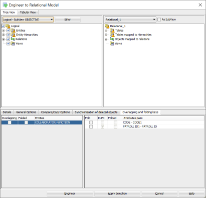

Figure 8 Engineer a subview

This was the result:

Figure 9 Relational model for manually created surrogate keys

The generation of super and subtypes for OBJECTIVE seems to be okay. But for UNIT there are no foreign keys and no arc. What went wrong?

The only difference I quickly saw was the Subtypes implementation. It seems that "References" and "Attributes inheritance" should be set like this:

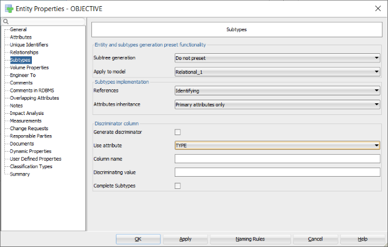

Figure 10 Properties for subtypes

Please note that I also defined a VARIATION attribute to be used as a discriminator. Another possibility would have been TYPE but that is a reserved word in SQL.

Please note the ID1 column in table OBJECTIVE. That must be the column for the foreign key of OBJECTIVE GROUPMENT that I forgot to add to the subview. 

After regeneration everything went fine except that no check constraints were defined for the discriminator columns.

## The second attempt with surrogate keys created by SQL Developer Data Modeler

This is the subview for which tables are generated:

Figure 11 Entities without surrogate keys

As you can see there are no surrogate keys yet in the ERD model. So how SQL Developer Data Modeler does that for you?

Well, not so well, 

These are two tables generated from this subview:

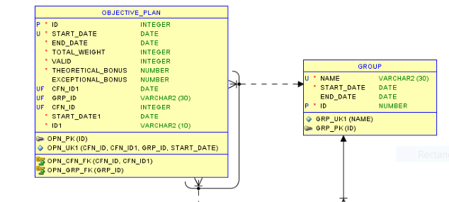

Figure 12 Tables with generated surrogate keys

The primary key of GROUP is the created surrogate key. That is correct. However, in OBJECTIVE_PLAN the datatype of GRP_ID is VARCHAR2(30), the datatype of GROUP.NAME that was the original primary key. So, this approach fails. Back to adding manually IDs to the ERD.

## Other problems encountered

Several problems occurred (after validating the relational model):

1. Abbreviation not copied;

2. Table has columns with undefined security options;

3. No comments defined;

4. No application prefix;

5. Table names are singular, not plural;

6. Some foreign keys or columns were not defined correctly;

7. No indexes on foreign keys;

8. Generated intersection table has the wrong name;

## Solutions

### Abbreviation not copied

Ensure that "Short Name" is filled with the abbreviation in the entity:
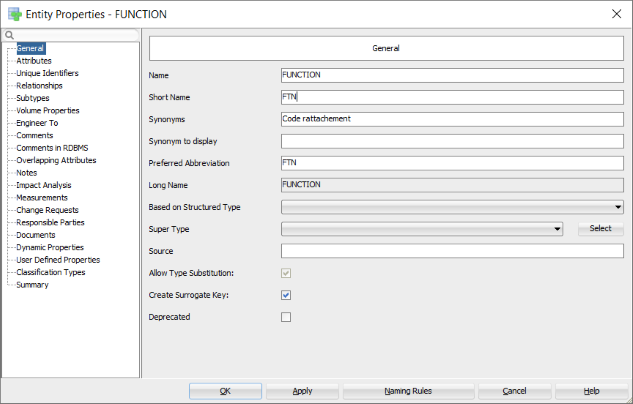

Figure 13 Abbreviation for table names

### Table has columns with undefined security options

Define them in the Security tab of Columns.

### No comments defined

The Design Rules complained about no comments defined. So, I created a custom transformation script, see "Copy Comments in RDBMS to Comments \- custom". 

### No application prefix

See [https://helifromfinland.blog/2016/11/21/how-to-define-a-prefix-for-tables/](https://helifromfinland.blog/2016/11/21/how-to-define-a-prefix-for-tables/) and use these settings:

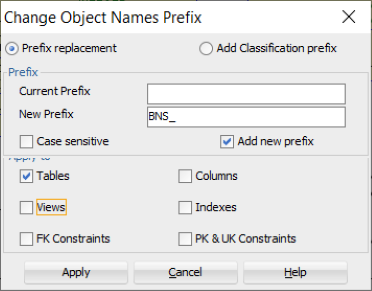

Figure 14 Adding application as prefix to tables

### Table names are singular, not plural

See "Table names plural \- custom".

### Some foreign keys or columns were not defined correctly

### No indexes on foreign keys

Use the custom transformation "Create index on FK".

### Columns ordering

Use the "Columns order" transformation to force primary key column(s) first, next foreign key column(s), next unique key column(s), mandatory column(s) and finally the optional column(s).

### Generated intersection table has the wrong name

Originally the many\-to\-many relation between GROUP and COLLABORATOR FUNCTION was "CFN \- GRP" (source abbreviation, space, minus sign, space, target abbreviation). That name was also created for the table name and thus not valid. So, I changed all relation names to source abbreviation, underscore, target abbreviation.

# Generate DDL

## Create the script

First set the correct RDBMS versions on the relational model:

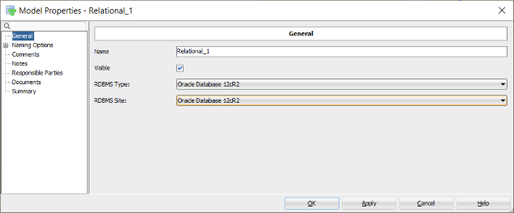

Figure 15 Set RDBMS version

 Next press the "Generate DDL" button, next "Generate" and "OK":

Please note that I used the "Advanced Interactive DDL" option to have more feedback while running:

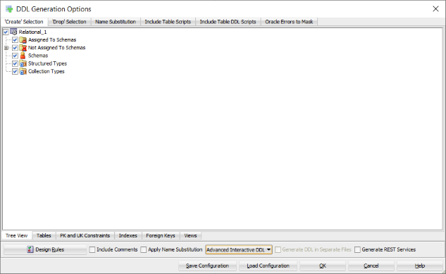

Figure 16 Create Advanced Interactive DDL

## Discriminator columns and values

Unfortunately there were some errors:

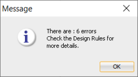

The Design Rules were ok, but at the end of the log the errors were shown:

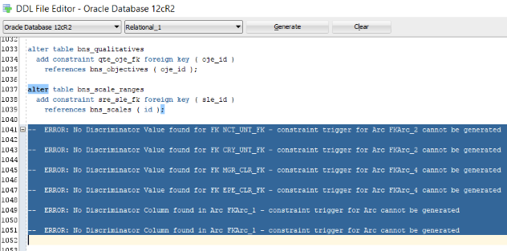

Figure 17 Log file shows errors

So just add discriminator values (the table abbreviation) to the foreign keys for the first four errors:

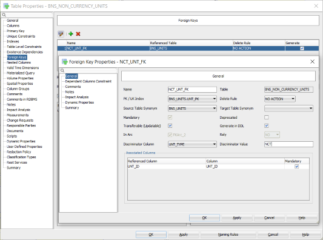

Figure 18 Add discriminator values

 And for the last two errors, a discriminator column must be added:

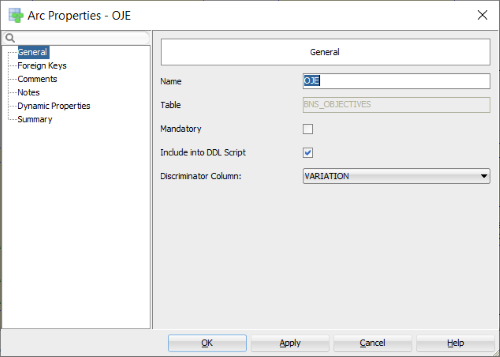

Figure 19 Add discriminator column

## Column check constraints

The next problem shows up: no check constraints for domains are generated.

After some searching, I saw that "Use Domain Constraints" was set to false:

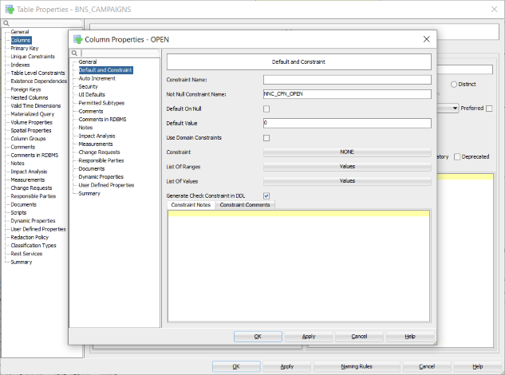

Figure 20 Use Domain Constraints unchecked

This calls for another custom transformation script, , see "Set Use Domain Constraints \- custom".

Next problem, the constraint name for CLR_ACTIVE was strange:

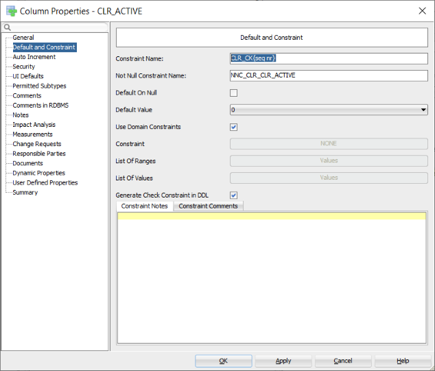

Figure 21 Strange constraint name

It turned out that the "Column Constraint Name" template (see "Naming standards") should better be set to empty or include the column name. The variable {seq nr} does not work for the column check constraint name template.

## Reserved words

Do not use reserved words like ORDER or COMMENT. It works but you have to double quote them in code, hence a big nuisance.

Finally, I could create my DDL file without double quotes (no reserved words, no strange names). 

Now running it against an empty schema, SCOTT in my case.

After solving some problems probably caused by the fact that I did not follow the best practices yet when I started, I got it all running without problems. No problems? Well, the names of arcs are not very nice in the generated DDL. 

## Arc names

So, I decided to change FKArc_* into FK_<table abbr 1>_<table abbr 2> for all arcs I had created myself:

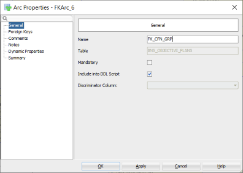

Figure 22 Manually created arc

For these arcs a check constraint is created like this: 

ADD CONSTRAINT FK_CFN_GRP CHECK

 And for arcs created as part of the super and subtypes generation, I decided to name them like this:

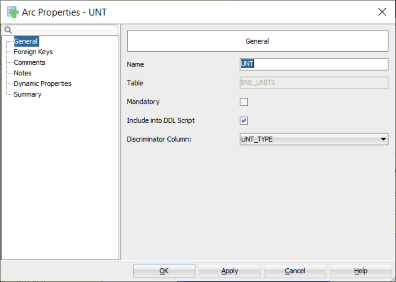

Figure 23 Generated arc for super and subtypes

For these arcs a trigger is created like this:

CREATE OR REPLACE TRIGGER ARC_UNT_BNS_NON_CURRENCY_UNITS

# Best practices

Well, our journey comes to an end. And what can I advise you as best practices?

## Logical model

1. Apply the configuration as described in the beginning;

2. Do not use reserved words like ORDER or COMMENT;

3. Use domains as much as possible;

4. Create surrogate keys yourself;

5. Use the Data Modeler default approach to create tables for each super and subtype entity while setting "References" to "Identifying"; 

6. Create a discriminator attribute named VARIATION in the super type entity and for verification purposes create a domain entity + " VARIATION" with possible values the abbreviations of the sub entities and assign it to the attribute;

7. Create many\-to\-many relations the old Oracle Designer way, i.e. only when there are no attributes;

8. Set short name to an abbreviation so it will be copied to the table abbreviation by using the "Copy Preferred Abbreviation to Short Name \- custom" transformation script (see "Appendix A Custom transformations");

9. Name relations like "source entity abbreviation" plus an underscore and "target entity abbreviation" by using the transformation script "Set Relation Name \- custom".

## Relational model

1. Verify the model thoroughly since there may have be errors since the tool or you might have made errors;

2. For the super and sub type arcs, specify the discriminator column;

3. For the foreign keys related to the super and subtypes, specify a discriminator value; 

4. Add an application prefix to tables and views only (right\-click the relational model and choose "Change Object Names Prefix");

5. Apply Naming Standards to Keys and Constraints (right\-click the relational model);

6. Copy properties "Comments in RDBMS" to "Comments" if the last one has not been set using transformation script "Copy Comments in RDBMS to Comments \- custom";

7. Let table names be plural except for intersection tables that have the relation name as their table name. Use transformation script "Table names plural \- custom";

8. Set default security options by using transformation script "Set security options \- custom";

9. Create indexes on foreign keys by running transformation script "Create index on FK";

10. Change the column order by running transformation script "Columns order";

11. Apply the "Set Use Domain Constraints \- custom" transformation script and be aware of a correct value for the "Column Check Constraint" template;

12. Change the arc names as described in "Arc names".

## Verification

Go to "Tools \-> Design Rules And Transformations \-> Design Rules", select "General", "Logical" and "Relational" as shown below and press "Apply Selected". Then you should see OK, 

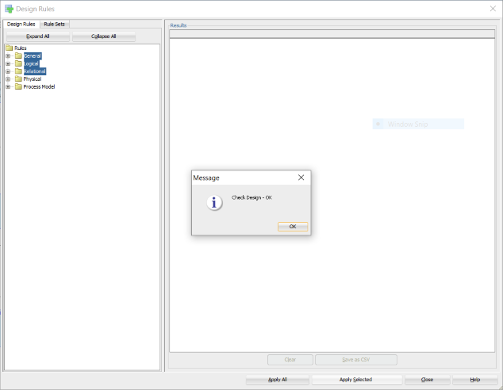

Figure 24 Verification okay

# Appendix A Custom transformations

I have created the following custom transformation scripts:

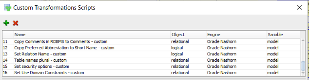

Figure 25 Really custom scripts

The code follows below:


## Copy Comments in RDBMS to Comments - custom
```
max_length = 4000;

function copyCommentsInRDBMS(object){
  if(object.getComment().equals("")){
    if(!object.getCommentInRDBMS().equals("")){
      if(object.getCommentInRDBMS().length()>max_length){
        object.setComment(object.getCommentInRDBMS().substring(0, max_length));
      }else{
        object.setComment(object.getCommentInRDBMS());
      }
      object.setDirty(true);
    }
  }
}

tables = model.getTableSet().toArray();

for (var t = 0; t<tables.length;t++){
  table = tables[t]
  copyCommentsInRDBMS(table);
  columns = table.getElements();
  size = table.getElementsCollection().size();
  for (var i = 0; i < columns.length; i++) {
    column = columns[i];
		copyCommentsInRDBMS(column);
  }

  keys = table.getKeys();
  for (var i = 0; i < keys.length; i++) {
    key = keys[i];
    if(!key.isFK()){
      copyCommentsInRDBMS(key);
    }else{
      copyCommentsInRDBMS(key.getFKAssociation());
    }
  }
}
```


## Copy Preferred Abbreviation to Short Name - custom
```
function copyPreferredAbbreviation(object) {
  if (object.getShortName().equals("")) { 
    var preferredAbbreviation = object.getPreferredAbbreviation();
    if (!preferredAbbreviation.equals("")) {
      object.setShortName(preferredAbbreviation);
      object.setDirty(true);
    }
  }
}

entities = model.getEntitySet().toArray();

for (var e = 0; e < entities.length; e++) {
  copyPreferredAbbreviation(entities[e]);
}
```


## Set Relation Name - custom

```
function setRelationName(object, name) {
  if (!object.getName().equals(name)) { 
    object.setName(name);
    object.setDirty(true);
  }
}

relations = model.getRelationSet().toArray();

for (var r = 0; r < relations.length; r++) {
  setRelationName(relations[r], relations[r].getSourceEntity().getPreferredAbbreviation() + '_' + relations[r].getTargetEntity().getPreferredAbbreviation());
}
```

## Table names plural - custom

```
var tables = model.getTableSet().toArray();
for (var t = 0; t<tables.length; t++){
  var table = tables[t];
  if (!table.getName().endsWith("S")) {
    table.setName(table.getName() + "S");
    table.setDirty(true);
  }
}
```

## Set security options - custom

```
tables = model.getTableSet().toArray();

for (var t = 0; t<tables.length;t++){
  table = tables[t];
  cols = table.getElements();
  for(var c = 0; c < cols.length; c++){
    if (cols[c].isContainsPII() != true) {
      cols[c].setContainsPII(false);
    }
  	if (cols[c].isContainsSensitiveInformation() != true) {
      cols[c].setContainsSensitiveInformation(false);
    }
  }
  table.setDirty(true);
}
```


## Set Use Domain Constraints - custom

```
tables = model.getTableSet().toArray();

for (var t = 0; t<tables.length;t++){
  table = tables[t];
  cols = table.getElements();
  for(var c = 0; c < cols.length; c++){
    if (cols[c].getDomain() != null && 
        cols[c].getDomain().getName() != "Unknown" && 
        cols[c].getUseDomainConstraints() != true) {
      cols[c].setUseDomainConstraints(true);
      table.setDirty(true);
    }
  }
}
```

